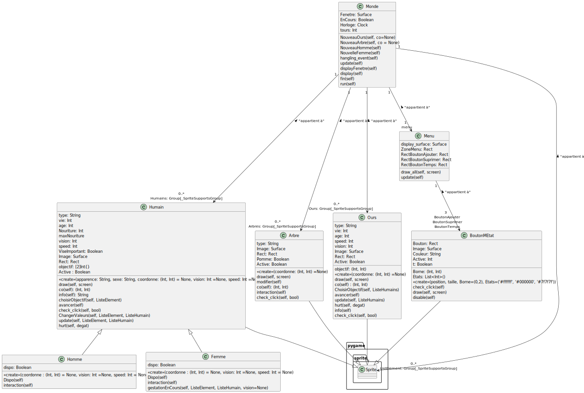

# Simulation-Informatique-d-une-population-en-Python---2023
Ceci est un de mes premiers programmes informatiques pour simuler l'évolution d'individue

## Documentation
Mon objectif est de créer mon portfolio, pour cela je récupère mes premiers programmes.
Pour autant je pense pas modifier sont fonctionnement, je vais juste permettre à n'importe qui de pouvoir le comprendre.
<br/>
Il a donc de nombreux défaults.
Par exemple :
* Le Franglais
* Les fautes d'orthographes (sans doute dans les deux langues) 
* Le manque d'optimisation
* ...


## Installation

Installer mon proget avec git

```bash
  git clone https://github.com/FlorianGandon/Simulation-Informatique-d-une-population-en-Python---2023.git
```
## Bibliothèques python utilisées

#### Pygame

```http
  pip install pygame
```

#### Noise

Noise permet de générer le monde aléatoirement avec du bruit de perlin mais il est compliqué de l'installer. Si il n'est pas installer le programme fonctionnera quand même mais sans la génération du terrain.

```http
  pip install wheel
```
installer Microsoft Visual C++ :
```http
  https://visualstudio.microsoft.com/fr/downloads/
```
```http
  pip install noise
```
## Screenshots

### Un exemple de simulation : 


### Le diagramme de classe UML


## Authors

- [@FlorianGandon](https://github.com/FlorianGandon)

